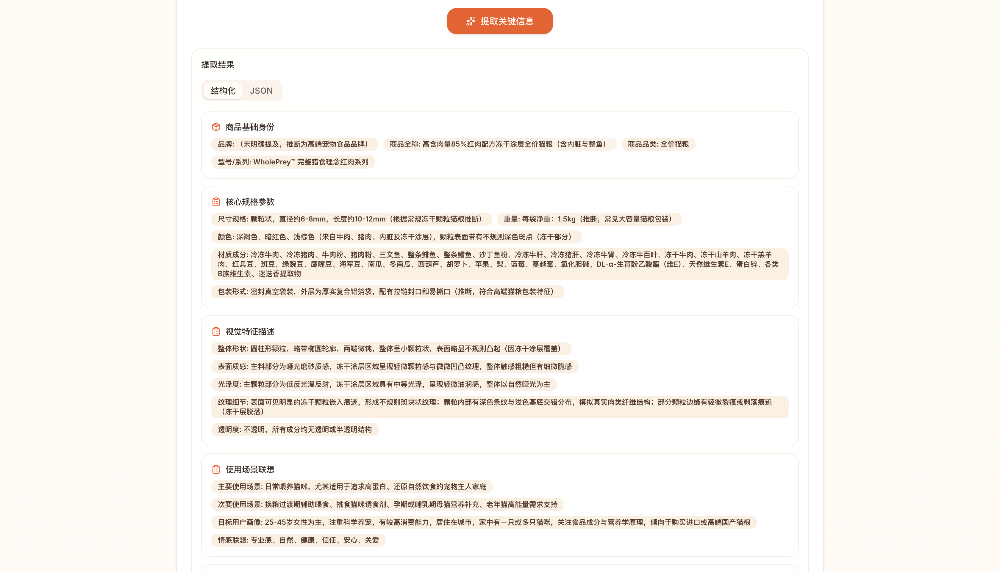
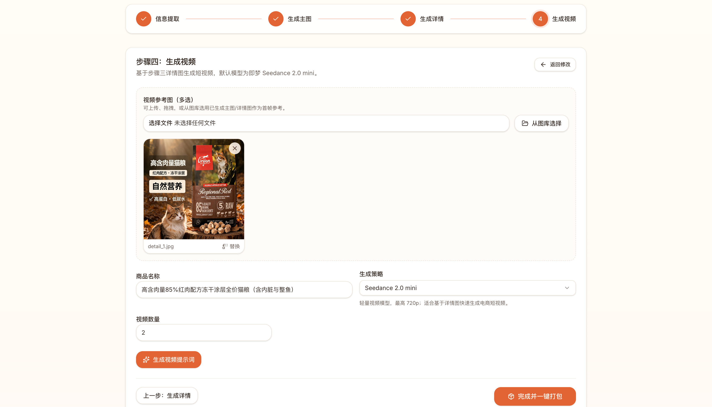
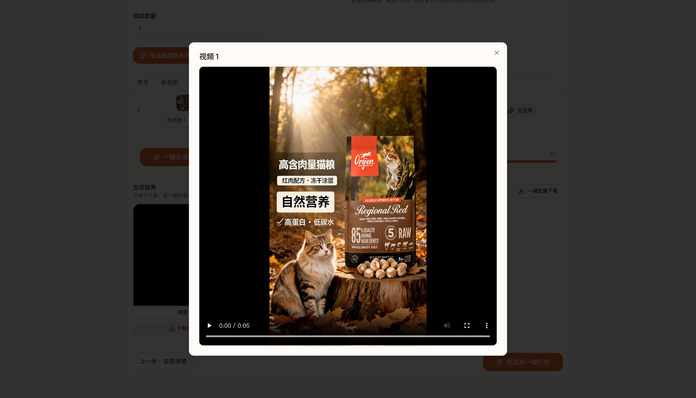

<h1 align="center">OneMix Web</h1>

<p align="center">
  OneMix Web 是一个面向电商运营场景的商品素材生成工具，采用 <strong>FastAPI + React + Vite</strong> 架构，覆盖从商品信息提取、提示词规划到主图/详情图/短视频批量生成的完整流程。<br/>
  适用于电商运营、店铺主理人、设计协作同学与内容团队，用于新品上架、活动改版、素材翻新、多平台分发等高频场景，帮助在保证风格统一的同时显著提升出图与出视频效率。
</p>
<p align="center">
  基于 <strong>GPL-3.0</strong> 开源，个人与企业均可<strong>免费商用</strong>——可用于店铺运营、团队内部部署、SaaS 接入等场景。<br/>
  修改或分发衍生版本时，请遵守 GPL-3.0 的源码公开与相同许可传递义务（详见下方「许可证」）。
</p>

<p align="center">
  
  
  
  
  
</p>

## 项目简介

OneMix Web 聚焦电商上新场景，帮助运营从商品资料中快速生成可上架的主图、详情图，并基于详情图/主图继续生成短视频。

典型链路包括：

1. OCR + 关键信息提取
2. 主图提示词规划 + 批量出图
3. 复用主图作为详情图参考 + 批量出图
4. 复用主图/详情图作为视频首帧参考 + Seedance 短视频生成
5. 结果预览、单槽位重构、分类 ZIP / 一键打包全部素材

## 核心特性

- 多源输入：支持文本 + 图片 OCR 混合输入（OCR 识别中有明确处理状态）
- 四步流程：信息提取 → 生成主图 → 生成详情 → 生成视频
- 分槽位提示词：支持批量规划，也支持单槽位重构
- 任务链路完整：进度轮询、结果预览、单张/批量 ZIP、全部素材一键打包
- 参考图回流：可把生成图直接设置为下一轮参考图；详情图可从主图库选用，视频可从主图/详情图库选用
- 模型可切换：阿里百炼（DashScope / Qwen-Image）与火山方舟（Seedream 生图、Seedance 生视频）

## 效果展示

### 商品图（生成结果）

海报展示：

<p>
  
</p>

主图展示：

<p>
  
  
  
  
</p>

详情图展示：

<p>
  
  
  
  
</p>

## 工作流示意

### 1) 商品信息提取

上传商品资料后，支持 OCR 与关键信息提取，自动回填商品名称和商品描述。




### 2) 主图提示词生成与主图出图

上传白底参考图后，系统会规划主图提示词并执行批量生成。有生成结果后方可进入下一步。


### 3) 详情图参考图设置与详情图出图

支持复用主图作为详情图参考，并一键生成详情图。有详情图结果后方可进入视频步骤。


### 4) 短视频生成与全部素材打包

基于主图/详情图作为首帧参考，使用火山方舟 **Seedance 2.0 mini**（默认）规划视频提示词并批量出片；完成后可「完成并一键打包」，按 `主图/`、`详情/`、`视频/` 分类导出 ZIP。




[点击欣赏生成的视频](./video/5秒猫粮视频.mp4)

> 使用 Seedance 前需在[火山方舟开通管理](https://console.volcengine.com/ark/region:cn-beijing/openManagement)开通对应模型，并在设置中保存火山方舟 API Key。

## 技术架构

### 后端（`backend/`）

- `backend/app/main.py`：FastAPI 入口与核心 API（含 `/api/jobs/bundle-all` 合并打包）
- `backend/app/routers/settings.py`：API Key 设置管理
- `backend/app/jobs_store.py`：任务状态和结果管理
- `backend/onemix/services/dashscope_svc.py`：模型调用封装（Seedream / Seedance / Qwen 等）
- `backend/onemix/services/slot_batch_gen.py`：槽位批量生图 / 生视频
- `backend/onemix/services/prompt_templates.py`：提示词模板中心

### 前端（`frontend/`）

- `frontend/src/pages/Home/index.tsx`：四步式主流程页面
- `frontend/src/components/steps/StepVideo.tsx`：步骤四生成视频
- `frontend/src/constants/index.ts`：前端常量与模型策略目录
- `frontend/vite.config.ts`：开发代理与构建配置

### 数据与产物

- 本地数据库：`backend/data/onemix.db`（SQLite）
- 任务缓存目录：`~/.cache/OneMix/jobs/<job_id>/export`（含 `主图/`、`详情/`、`视频/`）

## 快速开始

### 1) 克隆仓库

```powershell
git clone https://gitee.com/millerkai/one-mix.git
cd OneMix
```

### 2) 安装后端依赖

Windows:

```powershell
python3 -m venv .venv
.\.venv\Scripts\Activate
pip3 install -r requirements.txt
```

macOS / Linux:

```bash
python3 -m venv .venv
source .venv/bin/activate
pip3 install -r requirements.txt
```

### 3) 启动后端（默认 `8767`）

Windows:

```powershell
python3 backend\run_server.py
```

macOS / Linux:

```bash
python3 backend/run_server.py
```

### 4) 启动前端（默认 `5173`）

```powershell
cd frontend
npm install
npm run dev
```

启动后按终端提示打开浏览器地址即可（通常为 `http://localhost:5173/`）。

Docker 部署见 [`DOCKER.md`](./DOCKER.md)。

## 配置说明

系统支持阿里百炼（DashScope）与火山方舟（ARK），两套 Key 按如下优先级读取。页面「API Key 设置」中可直接跳转控制台：

- [阿里百炼 API Key](https://bailian.console.aliyun.com/cn-beijing?tab=model#/api-key)
- [火山方舟开通管理](https://console.volcengine.com/ark/region:cn-beijing/openManagement)

### DashScope Key 优先级

1. 请求头 `X-DashScope-Key` 或 `Authorization: Bearer ...`
2. 环境变量 `DASHSCOPE_API_KEY`
3. SQLite 默认 Key（`/api/settings/dashscope-key`）

### ARK Key 优先级

1. 请求头 `X-Ark-Key`
2. 环境变量 `ARK_API_KEY`
3. SQLite 默认 Key（`/api/settings/ark-key`）

> 使用豆包 Seedream 生图或 Seedance 生视频时，必须提供火山方舟 ARK Key，并在控制台开通对应模型，否则会返回 `401` 或 `ModelNotOpen`。

### 配置接口

- `GET /api/settings`
- `PUT /api/settings/dashscope-key`
- `DELETE /api/settings/dashscope-key`
- `PUT /api/settings/ark-key`
- `DELETE /api/settings/ark-key`

安全提示：默认 Key 会以明文保存在本地 SQLite。请勿提交数据库文件，公网部署请补充鉴权与访问控制。

## API 一览

- `GET /health`：健康检查
- `POST /api/ocr`：单图/多图 OCR
- `POST /api/extract/key-info`：文本 + 图片混合关键信息提取
- `POST /api/competitor`：竞品图理解与风格归纳
- `POST /api/plan/slots`：批量槽位提示词规划（主图 / 详情 / 视频）
- `POST /api/plan/single`：单槽位提示词重构
- `POST /api/jobs`：创建生图或生视频任务（multipart：`whites` + `job`）
- `GET /api/jobs/{job_id}`：查询任务进度与结果
- `GET /api/jobs/{job_id}/result/{list_index}`：查看单槽位结果（图或视频）
- `GET /api/jobs/{job_id}/bundle`：下载单任务 ZIP
- `POST /api/jobs/bundle-all`：按主图/详情/视频分类合并打包 ZIP

## 项目结构

```text
OneMix/
├─ backend/      # FastAPI 服务、任务编排、提示词模板
├─ frontend/     # React + Vite 前端
├─ images/       # README 展示图片与系统截图
├─ nginx/        # Docker / 反向代理配置
├─ 用户使用手册.md
├─ DOCKER.md
└─ README.md
```

## FAQ

### 为什么创建任务返回 401？

- DashScope 路线：确认 `X-DashScope-Key`、`DASHSCOPE_API_KEY` 或系统设置已配置可用 Key
- Seedream / Seedance 策略：必须提供 ARK Key（`X-Ark-Key` 或 `ARK_API_KEY`）

### Seedance 报 ModelNotOpen 怎么办？

账号尚未开通该视频模型。请到[火山方舟开通管理](https://console.volcengine.com/ark/region:cn-beijing/openManagement)申请开通 Seedance（如 `doubao-seedance-2-0-mini-260615`），审核通过后使用同一 ARK Key 重试。

### 服务重启后任务记录为什么不完整？

任务状态主要在内存维护。重启后会尝试从缓存目录恢复导出结果，但实时进度无法完全还原。

### 提示词不理想如何快速迭代？

推荐使用「单槽位重构提示词」+「单槽位重生成」，无需整批重跑。

### 可以商用吗？

可以。本项目采用 **GPL-3.0**，允许免费商业使用，包括但不限于：

- 电商团队/公司内部部署，用于日常出图、出视频与素材生产
- 将 OneMix 集成进自有业务系统（需自行承担 API 费用与安全加固）
- 基于本项目二次开发后对外提供付费或免费服务

请注意 GPL-3.0 的**传染性（Copyleft）**要求：若你**分发**（提供安装包、镜像、托管可下载的修改版等）基于本项目的衍生作品，须向接收方提供对应源代码，并以 GPL-3.0 许可。仅在内网自用、不对外分发二进制/镜像时，通常无强制开源义务，具体以 [`LICENSE`](./LICENSE) 及当地法律为准。

## 近期更新

### v0.3（2026-08）

- **四步流程**：新增步骤四「生成视频」，默认模型即梦 Seedance 2.0 mini
- **视频参考图**：可从已生成主图、已生成详情图或已上传参考图中选择首帧
- **一键打包**：步骤四「完成并一键打包」，按 `主图/`、`详情/`、`视频/` 分类导出
- **API Key 设置**：阿里百炼 / 火山方舟卡片增加控制台跳转；文案统一为「火山方舟」
- **交互优化**：下一步需有生成结果才可进入；去掉与面板重复的生成/下载按钮；OCR 增加识别中状态

### v0.2（2026-07）

- **生图策略**：豆包 / 千问分组选择，支持同步开通状态；列表仅展示支持图生图的模型
- **结果下载**：生成结果支持单张下载与一键批量 ZIP
- **尺寸与分辨率**：按当前模型官方参数下拉选择，支持批量应用到全部槽位
- **提示词规划**：改用 `qwen-vl-plus`，结合白底参考图生成 / 重构提示词
- **详情图**：默认尺寸 `9:16`（当前模型无该比例时回退 `2:3` / `3:4`）；按模型生成尺寸直接导出 JPG
- **暗色模式**：修复顶栏文案与页面背景在黑夜模式下的对比度

## Roadmap

- [ ] 增加多商品批量任务队列与优先级调度
- [ ] 增加提示词版本管理与一键回滚
- [ ] 增加结果图 / 视频自动质检（清晰度、构图、文案可读性）
- [x] 增加 Docker 一键部署与生产环境模板（见 `DOCKER.md`）
- [ ] 增加英文界面与多语言提示词策略
- [ ] 视频时长、音频开关等 Seedance 高级参数的可视化配置

## 贡献指南

欢迎提交 Issue 与 PR，共同完善 OneMix。

1. Fork 本仓库并创建功能分支（如 `feat/xxx`、`fix/xxx`）
2. 提交前确保本地可启动且核心流程可跑通
3. 在 PR 描述中说明改动动机、影响范围、验证方式
4. 若改动涉及 UI，请附关键截图或录屏

建议优先贡献方向：

- 提示词模板策略优化
- 前端交互体验与可视化增强
- 任务系统稳定性与性能优化
- 文档与示例完善

## 许可证

本项目采用 **[GNU General Public License v3.0（GPL-3.0）](https://www.gnu.org/licenses/gpl-3.0.html)**，完整文本见根目录 [`LICENSE`](./LICENSE)。

| 场景 | 是否允许 |
| --- | --- |
| 个人学习、研究 | ✅ |
| 企业内部商用、店铺运营出图 / 出视频 | ✅ |
| 修改源码并内网部署（不分发） | ✅ |
| 修改后对外分发 / 提供可获取的二进制或镜像 | ✅（须同步提供源码，并以 GPL-3.0 许可） |
| 移除版权声明或许可证后闭源分发 | ❌ |

**简要说明：** GPL-3.0 保障你使用、研究、修改与再分发的自由，也要求你在再分发衍生版本时保持相同自由。软件按「原样」提供，不含任何担保。

> 使用、修改或分发本项目，即表示你同意 `LICENSE` 全部条款。第三方模型 API（阿里百炼、火山方舟等）的费用与合规由使用者自行承担，与本项目许可证无关。

## 相关文档

- 用户使用手册：[`用户使用手册.md`](./用户使用手册.md)
- Docker 部署（先本地 `frontend` 构建 `dist`）：[`DOCKER.md`](./DOCKER.md)

如果在使用过程中遇到问题，欢迎扫码加入交流群，我们会尽快协助解答：

<p align="center">
  
</p>
